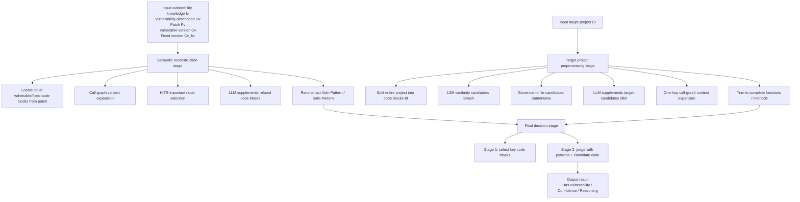

# VulnSight

> A semantic-level vulnerability existence verification tool based on **patches + vulnerability descriptions + vulnerable-version / fixed-version code + target project code**.
>
> It does not simply match version numbers, nor does it rely only on string search. Instead, it first **reconstructs the vulnerability’s semantic pattern** from the vulnerable and fixed versions, then builds a candidate space in the target project, and finally uses an LLM to make a **semantic-level vulnerability reoccurrence judgment**.

---

## Table of Contents

- [1. Project Overview](#1-project-overview)
- [2. Core Capabilities](#2-core-capabilities)
- [3. Workflow Overview](#3-workflow-overview)
- [4. Project Structure](#4-project-structure)
- [5. Environment Requirements](#5-environment-requirements)
- [6. Installation and Preparation](#6-installation-and-preparation)
- [7. Quick Start](#7-quick-start)
- [8. Command-Line Arguments](#8-command-line-arguments)
- [9. Input Data Requirements](#9-input-data-requirements)
- [10. Output Description](#10-output-description)
- [11. Core Algorithm Explanation](#11-core-algorithm-explanation)
- [12. Module Description](#12-module-description)
- [13. Python API Usage](#13-python-api-usage)
- [14. Example Data and Test Cases](#14-example-data-and-test-cases)
- [15. Caching Mechanism](#15-caching-mechanism)
- [16. Known Limitations and Notes](#16-known-limitations-and-notes)
- [17. FAQ](#17-faq)
- [18. Future Improvement Directions](#18-future-improvement-directions)

---

## 1. Project Overview

VulnSight is designed to answer a more semantic question:

**“Does this target project reintroduce the essential behavior of a known vulnerability?”**

Traditional approaches usually rely on the following methods:

1. **Version comparison**: determine whether the target project falls within an affected version range;
2. **Patch search**: check whether some characteristic code before or after a patch appears in the target code;
3. **Rule matching**: match against fixed rules or signatures.

These approaches can easily fail in the following situations:

- The target project is not the original project, but a **fork / secondary development version / ported implementation**;
- The vulnerable logic has been **renamed, refactored, or split apart**;
- The fix exists in a **different implementation form**, so it cannot be recognized directly through string-level diff;
- The target project does not fully preserve the original file structure, but the **semantic behavior is still equivalent**.

VulnSight works as follows:

- It uses the vulnerability description `Dv`, patch `Pv`, vulnerable-version code `Cv`, and fixed-version code `Cv_fix` to jointly reconstruct:
  - **Vuln-Pattern**
  - **Safe-Pattern**
- It then analyzes the target project `Ct` using:
  - code block segmentation
  - local similarity retrieval (LSH / MinHash)
  - same-name file fallback
  - LLM-assisted expansion
  - call-graph context expansion
- Finally, it sends candidate code blocks to the LLM for two-stage decision making:
  1. first select the key blocks most worth expanding;
  2. then make the final judgment by combining the vulnerability pattern, safe pattern, and target code.

Therefore, VulnSight is a **vulnerability semantic verification pipeline**, rather than a simple string-matching script.

---

## 2. Core Capabilities

### 2.1 Implemented Capabilities

- Automatically locate patch-related code blocks in the vulnerable and fixed versions based on unified diff;
- Automatically reconstruct vulnerability patterns and fix patterns by combining the vulnerability description with patch differences;
- Perform function-level / method-level / file-level code block segmentation on the target project;
- Build an initial candidate set using MinHash + approximate Jaccard similarity;
- Use an LLM to supplement files/functions in the target project that may have been missed but are semantically related;
- Support caching of semantic reconstruction results to avoid repeated LLM costs;
- Output structured conclusions:
  - whether the vulnerability exists
  - confidence
  - reasoning

### 2.2 Supported Languages at the Code Level

Based on the repository code, the current design supports:

- **Python**
- **Java**
- **C / C++**
- As well as **whole-file fallback scanning** for other languages/configuration files

---

## 3. Workflow Overview



If viewed only from the execution order, it can be understood simply as:

1. **Load vulnerability knowledge**;
2. **Learn what the vulnerability looks like from the vulnerable and fixed versions**;
3. **Find the most similar candidate code in the target project**;
4. **Use the LLM to compare the vulnerability pattern / safe pattern / target code together**;
5. **Return yes/no + confidence + reasoning**.

---

## 4. Project Structure

Based on the current archive, the main repository structure is as follows:

```text
VulnSight/
├─ README.md                      # Project documentation
├─ LICENSE.txt                    # Open-source license
├─ requirements.txt               # Python dependency list
├─ pyproject.toml                 # Project build and packaging config
├─ .gitignore                     # Git ignore rules
├─ 使用.txt                        # Early Chinese usage notes (recommended to remove later or merge into docs/)
│
├─ docs/
│  └─ usage_zh.md                 # Chinese usage documentation
│
├─ examples/                      # Example data and reproducible experiment cases
│  ├─ test/                       # Example 1: cleo vulnerability detection case
│  │  ├─ b5b9a04d2caf58bf7cf94eb7ae4a1ebbe60ea455.patch
│  │  ├─ 漏洞描述.txt
│  │  ├─ 测试结果1.txt
│  │  ├─ cleo-0.7.2/              # Target version to be checked
│  │  ├─ cleo-1.0.0/              # Vulnerable reference version
│  │  └─ cleo-2.2.1/              # Fixed reference version
│  │
│  └─ test2/                      # Example 2: fastapi / python-multipart case
│     ├─ 漏洞描述.txt
│     ├─ repair.patch
│     ├─ target1/                 # Target project 1 to be checked
│     ├─ target2/                 # Target project 2 to be checked
│     ├─ fix/                     # Fixed reference version
│     └─ vul/                     # Vulnerable reference version
│
├─ src/
│  ├─ run_VulnSight.py                # CLI entry script
│  ├─ cache/                      # Cache generated during execution
│  │  └─ anon_596fd59a40bda322.json
│  │
│  └─ vulnsight/                      # VulnSight core source package
│     ├─ __init__.py
│     ├─ vulnsight.py                 # Top-level VulnSight class and main workflow orchestration
│     ├─ types.py                 # Core data structure definitions
│     ├─ semantic_reconstruction.py
│     │                           # Vulnerability/fix semantic reconstruction
│     ├─ preprocess_target.py     # Target project candidate-space construction
│     ├─ prompt_decision.py       # Final LLM decision stage
│     ├─ utils.py                 # Utility functions for file trees, code block summaries, etc.
│     ├─ callgraph_builder.py     # Unified interface for call-graph construction
│     ├─ callgraph_pycg.py        # Python call-graph construction
│     ├─ callgraph_java.py        # Java call-graph construction
│     ├─ callgraph_clang.py       # C/C++ call-graph construction
│     │
│     └─ tool/
│        └─ Jarvis/               # Built-in Python call-graph analysis tool
│           ├─ external_interface.py
│           ├─ jarvis.py
│           ├─ jarvis_cli.py
│           ├─ formats/           # Call-graph output formats
│           ├─ machinery/         # Core logic of call-graph analysis
│           ├─ processing/        # Processing pipeline and preprocessing modules
│           └─ utils/             # Internal Jarvis utilities
│
└─ tests/                         # Test directory
```

### 4.1 Entry Points

The main entry points of the project are:

- `run_VulnSight.py`: command-line execution;
- `vulnsight.VulnSight`: Python API invocation.

---

## 5. Environment Requirements

### 5.1 Python Version

Recommended:

- **Python 3.10+**

The current experiments use `Python 3.10`, so `Python 3.10` is a safe choice.

### 5.2 Core Dependencies

The repository already provides dependency declaration files, including:

- `requirements.txt`: for quick installation of runtime dependencies
- `pyproject.toml`: for project metadata, build method, and dependency configuration

Dependencies can be installed with:

```bash
pip install -r requirements.txt
```

Minimum recommended installation:

```bash
pip install openai unidiff
```

If you want to enable more language capabilities, it is also recommended to install:

```bash
pip install javalang
pip install clang
```

Notes:

- `openai`: used to call model interfaces compatible with the OpenAI SDK;
- `unidiff`: used to parse `.patch` / unified diff;
- `javalang`: Java method-level parsing;
- `clang`: Python bindings required for C/C++ call-graph capability;
- Python call-graph capability depends on the built-in `vulnsight/tool/Jarvis` in the repository, so no additional PyCG installation is required.

### 5.3 External Model Service Requirements

The current `run_VulnSight.py` uses:

- OpenAI SDK calling style;
- `base_url="https://api.deepseek.com"`;
- `model="deepseek-chat"`.

That means **this project requires an available LLM API endpoint**. You may modify it according to your own needs. The API key should be placed in the `LLM_API_KEY` environment variable, as described in Section 6.4.

---

## 6. Installation and Preparation

### 6.1 Clone / Extract the Project

```bash
unzip VulnSight.zip
cd VulnSight
```

### 6.2 Create a Virtual Environment (Recommended)

**Windows PowerShell**

```powershell
python -m venv .venv
.\.venv\Scripts\Activate.ps1
```

**Linux / macOS**

```bash
python -m venv .venv
source .venv/bin/activate
```

### 6.3 Install Dependencies

```bash
pip install --upgrade pip
pip install openai unidiff javalang clang
```

If you only want to run the current example first, the minimum installation is:

```bash
pip install openai unidiff
```

### 6.4 Configure the Model API Key

**Bash**

```bash
export LLM_API_KEY="your_api_key"
```

**PowerShell**

```powershell
$env:LLM_API_KEY="your_api_key"
```

> It is strongly recommended to configure the key only via environment variables. Do not hardcode real keys into the source code.

---

## 7. Quick Start

### 7.1 Run the Example Directly

The repository you provided already includes runnable example data. The most common startup method is:

```bash
python run_VulnSight.py \
  --vuln-id CLEO-EXAMPLE \
  --patch examples/test/b5b9a04d2caf58bf7cf94eb7ae4a1ebbe60ea455.patch \
  --desc examples/test/漏洞描述.txt \
  --vuln-root examples/test/cleo-1.0.0 \
  --fix-root examples/test/cleo-2.2.1 \
  --target-root examples/test/cleo-0.7.2
```

An example of the output you provided is:

```text
=== VulnSight Result ===
Vulnerability ID: CLEO-EXAMPLE
Target project: test/cleo-0.7.2
Has vulnerability: False
Confidence: 0.95
Reasoning:
  The target project appears to be version 0.7.2 of cleo (based on pyproject.toml), which predates the vulnerability patch. The provided candidate code blocks do not include the table.py file where the vulnerable regex would be located. However, the semantic patterns indicate the vulnerability is in the Table.set_rows method and the _render_cell function.
```

### 7.2 Recommended First Usage Pattern for Python Targets

If you only want to quickly verify the workflow, it is recommended to first:

- omit `--lang`;
- make sure the paths to the patch, vulnerability description, vulnerable version, fixed version, and target version are all correct;
- run the main workflow successfully first, then enable language-enhanced capabilities as needed.

This is because, in the current repository, the default mode without `--lang` bypasses part of the call-graph expansion logic and is often more stable in practice.

---

## 8. Command-Line Arguments

`run_VulnSight.py` supports the following arguments:

### `--vuln-id`
Vulnerability identifier.

Example:

```bash
--vuln-id CVE-2024-24762
```

Or, in the example data:

```bash
--vuln-id CLEO-EXAMPLE
```

### `--patch`
Path to the patch diff file, which must be in unified diff format.

Example:

```bash
--patch test/b5b9a04d2caf58bf7cf94eb7ae4a1ebbe60ea455.patch
```

### `--desc`
The vulnerability description text. It can be provided in either form:

1. directly as raw text;
2. as a `.txt` or `.md` file path.

If the input is an existing `.txt` or `.md` file path, the program will automatically read the file content.

### `--vuln-root`
The vulnerable-version code directory, i.e., the **reference version confirmed to contain the vulnerability**.

### `--fix-root`
The fixed-version code directory, i.e., the **reference version confirmed to contain the patch**.

### `--target-root`
The target project directory to be checked.

It can be:

- an older version of the original project;
- a fork;
- a refactored approximate implementation;
- a codebase suspected of reintroducing the same vulnerability semantics.

### `--lang`
Language hint. Example values:

```bash
--lang python
--lang java
--lang c
--lang cpp
```

Purpose:

- tells the system which type of call-graph builder to prioritize;
- affects language-specific logic in semantic reconstruction and target-project preprocessing.

> In the current repository, `--lang` is not required. If omitted, the system mainly relies on code block segmentation, LSH, and LLM expansion, which is usually more stable.

---

## 9. Input Data Requirements

VulnSight does not take a single file as input, but rather a combination of **vulnerability knowledge + target code**.

### 9.1 Required Inputs

#### 1) Vulnerability description `Dv`

It can come from:

- CVE/GHSA descriptions;
- security advisories;
- your own curated vulnerability notes.

It is recommended that the content include at least:

- vulnerability type (e.g., RCE / SQLi / ReDoS / path traversal);
- triggering conditions;
- entry point / affected functions / affected modules;
- fix direction (if known).

#### 2) Patch diff `Pv`

This is one of VulnSight’s key inputs.

Requirements:

- use unified diff format;
- the file paths in the diff should correspond to actual files under `--vuln-root` and `--fix-root`;
- ideally come from a real fixing commit.

VulnSight uses the hunks in the patch to:

- locate `Bv(0)` in the vulnerable-version code;
- locate `Bvfix(0)` in the fixed-version code;
- use them as the starting point for later semantic reconstruction.

#### 3) Vulnerable-version code `Cv`

This is the reference version **confirmed to contain the vulnerability**.

#### 4) Fixed-version code `Cv_fix`

This is the reference version **confirmed to be fixed**.

#### 5) Target project code `Ct`

This is the code directory that VulnSight finally determines to be vulnerable or not.

### 9.2 The Relationships Among Inputs Matter Greatly

To obtain more reliable results, make sure that:

- the old side of `patch` corresponds to `vuln-root`;
- the new side of `patch` corresponds to `fix-root`;
- `desc` describes the same vulnerability;
- `target-root` is the actual target code tree you want to verify.

If these four elements do not match, the program may still run to completion, but the semantic judgment will be significantly distorted.

---

## 10. Output Description

The program ultimately prints a structure like this:

```text
=== VulnSight Result ===
Vulnerability ID: ...
Target project: ...
Has vulnerability: ...
Confidence: ...
Reasoning:
 ...
```

The fields mean the following.

### `Vulnerability ID`
The input vulnerability identifier.

### `Target project`
The input target project path.

### `Has vulnerability`
A boolean value:

- `True`: the model judges that the target project **contains** the vulnerability semantics;
- `False`: the model judges that the target project **does not contain** the vulnerability semantics.

### `Confidence`
A confidence score, usually in the range `0 ~ 1`.

This is not a statistically rigorous probability. It is the confidence value produced by the LLM in the final decision stage, then parsed by the code and clipped to `[0,1]`.

### `Reasoning`
The final explanatory text.

This section generally explains:

- where the model believes the vulnerability semantics lie;
- whether corresponding dangerous behavior was found in the target project;
- whether an equivalent fix exists;
- why the final judgment is vulnerable / not vulnerable.

---

## 11. Core Algorithm Explanation

This section is the key part of the project.

### 11.1 Stage One: Semantic Reconstruction (`semantic_reconstruction.py`)

Goal: learn **what the vulnerability looks like** and **what the fix looks like** from the vulnerable and fixed versions.

#### Step 1: Locate initial patch-related code blocks

Through `locate_patch_blocks()`:

- parse `patch_diff`;
- for each hunk:
  - extract the old code block `Bv0` from `vuln-root`;
  - extract the new code block `Bvfix0` from `fix-root`.

This step yields the **raw code fragments closest to the patch**.

#### Step 2: Call-graph context expansion

If an available language hint is specified, the system will try to:

- build the vulnerable-version call graph `Gv`;
- build the fixed-version call graph `Gvfix`;
- find one-hop context code blocks adjacent to the patch blocks.

The reason is:

> A vulnerability often does not exist solely within a single patch hunk, but depends on upstream/downstream functions, input sources, helper validation functions, or error-handling paths.

#### Step 3: HITS important node supplementation

Run `hits_scores()` on the call graph and select the top-scoring node blocks to supplement the **most important functions in terms of graph structure**.

#### Step 4: LLM-assisted expansion

`llm_expand_blocks()` sends the following to the LLM:

- vulnerability description `Dv`
- patch `Pv`
- summaries of the extracted code blocks
- project file tree

and asks:

> Which other files/code regions, although not in the patch hunks, are still highly related to the vulnerability semantically?

#### Step 5: Extract vulnerability semantic patterns and fix semantic patterns

`llm_extract_patterns()` outputs two categories of patterns based on vulnerable code blocks `Bv` and fixed code blocks `Bvfix`:

- **Vuln-Pattern**
  - root cause
  - control-flow condition
  - data-flow condition
  - positive tests

- **Safe-Pattern**
  - fix description
  - control-flow fix
  - data-flow fix
  - negative tests

This step essentially abstracts a **concrete patch** into a **transferable semantic pattern**.

---

### 11.2 Stage Two: Target Project Candidate-Space Construction (`preprocess_target.py`)

Goal: find the candidate code blocks in the target project that are **most worth judging**, instead of feeding the entire project into the LLM.

#### Step 1: Full-project code block segmentation

`build_blocks_for_project()` segments code at different granularities based on file type:

- **Python**: prefer AST-based extraction of function/class-level blocks; fall back to heuristic segmentation on failure;
- **Java**: prefer `javalang` method-level extraction; fall back to heuristic segmentation on failure;
- **Other languages / configuration files**: one whole-file block.

#### Step 2: LSH similarity candidates

`select_shash()` uses:

- tokenization;
- MinHash signatures;
- approximate Jaccard similarity;

to compare target blocks with reference vulnerable/fixed blocks and filter a similar candidate set `Shash`.

#### Step 3: Same-name file fallback

If the target project contains files with the same name as reference blocks, they are also added to the candidate set.

This is a very practical engineering fallback because:

- many vulnerabilities in forked projects retain the original file names;
- even if the code content changes, the file name is still a strong signal.

#### Step 4: LLM supplements target candidates

`llm_expand_target()` uses:

- vulnerability description
- patch
- reference block summaries
- target project file tree
- already selected candidate blocks

and asks the LLM to additionally suggest:

- possibly related files;
- possibly related functions / methods;
- approximate line ranges.

#### Step 5: One-hop call-graph expansion

If a call graph is available, the current candidate blocks are further expanded to one-hop neighbors.

#### Step 6: Expand to complete functions / methods

`expand_block_range()` tries to trim blocks into complete functions/methods, rather than retaining only partial fragments, to reduce LLM misjudgment.

The final outputs are:

- `Bt`: all code blocks in the target project;
- `Scand`: final candidate code blocks;
- `global_signals`: precomputed global signals.

---

### 11.3 Stage Three: Final Decision (`prompt_decision.py`)

The final judgment uses a **two-stage LLM decision process**.

#### Stage 1: Important block selection

First, the candidate block summary list is sent to the LLM, which selects:

- the code blocks most worth expanding in full;
- the key functions/classes most likely to affect the final conclusion.

This is to reserve the token budget for the code that truly matters.

#### Stage 2: Final vulnerability judgment

The second stage sends the following information together to the LLM:

- vulnerability description `Dv`
- patch diff `Pv`
- reference vulnerable/fixed code blocks `Bv_ref`
- vulnerability pattern / safe pattern
- target candidate code blocks `Scand`
- global signals (e.g., whether certain key fix symbols appear)

Then it asks the LLM to output:

```text
YES or NO
CONFIDENCE: 0.x
Reasoning...
```

The code then parses this result into:

- `has_vuln`
- `confidence`
- `raw_reasoning`

---

## 12. Module Description

### `run_VulnSight.py`

CLI entry point.

Responsibilities:

- parse command-line arguments;
- read the patch and vulnerability description;
- construct `VulnKnowledge`;
- initialize `VulnSight`;
- print the final result.

### `vulnsight/vulnsight.py`

Project orchestrator module.

Responsibilities:

- organize the main workflow of “semantic reconstruction -> target preprocessing -> final decision”;
- manage semantic reconstruction cache;
- expose `VulnSight.verify()` externally.

### `vulnsight/types.py`

Defines core data structures, including:

- `CodeSpan`
- `VulnPattern`
- `SafePattern`
- `VulnKnowledge`
- `CodeBlock`
- `CallGraph`
- `PatternPair`
- `PredictionResult`

### `vulnsight/semantic_reconstruction.py`

Responsible for extracting semantic knowledge from the vulnerable and fixed versions.

### `vulnsight/preprocess_target.py`

Responsible for target-project candidate-space construction. This is the most engineering-heavy part.

### `vulnsight/prompt_decision.py`

Responsible for final LLM prompt organization and result parsing.

### `vulnsight/callgraph_*`

Provide language-specific call-graph builders:

- Python: `callgraph_pycg.py`
- Java: `callgraph_java.py`
- C/C++: `callgraph_clang.py`

### `vulnsight/tool/Jarvis/`

The directory of the built-in Python call-graph analysis tool.

---

## 13. Python API Usage

In addition to the CLI, you can also call VulnSight directly in Python code.

### 13.1 Minimal Example

```python
from openai import OpenAI
from vulnsight import VulnSight, VulnKnowledge

client = OpenAI(
    api_key="your_api_key",
    base_url="https://api.deepseek.com",
)


def my_llm(prompt: str) -> str:
    resp = client.chat.completions.create(
        model="deepseek-chat",
        messages=[
            {"role": "system", "content": "You are a helpful vulnerability analysis assistant."},
            {"role": "user", "content": prompt},
        ],
        temperature=0.2,
    )
    return resp.choices[0].message.content


vuln = VulnKnowledge(
    vuln_id="CLEO-EXAMPLE",
    desc=open("test/漏洞描述.txt", "r", encoding="utf-8").read(),
    patch_diff=open("test/b5b9a04d2caf58bf7cf94eb7ae4a1ebbe60ea455.patch", "r", encoding="utf-8").read(),
    vuln_proj_root="test/cleo-1.0.0",
    fix_proj_root="test/cleo-2.2.1",
)

vulnsight = VulnSight(
    llm=my_llm,
    language_hint="",
)

result = vulnsight.verify(
    target_root="test/cleo-0.7.2",
    vuln=vuln,
)

print(result.has_vuln)
print(result.confidence)
print(result.raw_reasoning)
```

### 13.2 Tunable Parameters

`VulnSight(...)` currently supports:

- `llm`: the LLM calling function, which takes a prompt and returns plain text;
- `language_hint`: language hint;
- `hits_top_k`: number of HITS-selected nodes in the semantic reconstruction stage;
- `jaccard_threshold`: LSH similarity threshold;
- `num_perm`: number of MinHash permutations;
- `cache_enabled`: whether to enable caching.

For example:

```python
vulnsight = VulnSight(
    llm=my_llm,
    language_hint="python",
    hits_top_k=20,
    jaccard_threshold=0.6,
    num_perm=64,
    cache_enabled=True,
)
```

---

## 14. Example Data and Test Cases

The archive contains at least two test cases.

### 14.1 cleo Example (`test/`)

Related files:

- `examples/test/b5b9a04d2caf58bf7cf94eb7ae4a1ebbe60ea455.patch`
- `examples/test/漏洞描述.txt`
- `examples/test/cleo-1.0.0/` (vulnerable version)
- `examples/test/cleo-2.2.1/` (fixed version)
- `examples/test/cleo-0.7.2/` (target version)

This example is used to determine whether `cleo-0.7.2` reintroduces the reference vulnerability.

### 14.2 fastapi / python-multipart Example (`test2/`)

Related directories/files:

- `examples/test2/vul/`
- `examples/test2/patch/`
- `examples/test2/target1/`
- `examples/test2/target2/`
- `examples/test2/漏洞描述.txt`
- `examples/test2/20f0ef6b4e4caf7d69a667c54dff57fe467109a4`
- `examples/test2/fastapi9d34ad0ee8a0dfbbcce06f76c2d5d851085024fc`

You can extend this into commands like:

```bash
python run_VulnSight.py \
  --vuln-id fastapi-EXAMPLE \
  --patch examples/test2/20f0ef6b4e4caf7d69a667c54dff57fe467109a4 \
  --desc examples/test2/漏洞描述.txt \
  --vuln-root examples/test2/vul \
  --fix-root examples/test2/patch \
  --target-root examples/test2/target1
```

and:

```bash
python run_VulnSight.py \
  --vuln-id fastapi-EXAMPLE \
  --patch examples/test2/20f0ef6b4e4caf7d69a667c54dff57fe467109a4 \
  --desc examples/test2/漏洞描述.txt \
  --vuln-root examples/test2/vul \
  --fix-root examples/test2/patch \
  --target-root examples/test2/target2
```

---

## 15. Caching Mechanism

VulnSight implements **semantic reconstruction caching** in `vulnsight/vulnsight.py`.

### 15.1 Cached Content

The cache mainly stores:

- `vuln_pattern`
- `safe_pattern`
- `vuln_blocks`
- `fix_blocks`

In other words, what is cached is the intermediate result of the **vulnerability semantic reconstruction stage**, rather than the final judgment result for a target project.

### 15.2 Cache Location

The cache directory is:

```text
src/cache/
```

Note that the `./` here refers to the **current working directory at runtime**, not the source-code directory of the project in a hard-bound way.

### 15.3 Benefits of Caching

When you repeatedly reuse the same set of:

- vulnerability description
- patch
- vulnerable version
- fixed version

to detect different target projects, caching can significantly reduce repeated LLM calls.

This is especially useful for batch verification across multiple targets.

---

## 16. Known Limitations and Notes

This section is very important. The following points are real caveats summarized from static analysis of the current repository code.

### 16.1 Strong Dependence on LLM Output Format

Many intermediate steps in the project rely on the LLM outputting content in specific formats, such as:

- JSON
- tagged text
- YES/NO + CONFIDENCE

Although the code includes some fallback parsing, if the model does not follow the format, it may still cause:

- candidate expansion failure;
- incomplete pattern extraction;
- degradation to default behavior.

Therefore, it is recommended to:

- choose a model with strong instruction-following ability;
- keep the temperature low (e.g., `0.2`);
- avoid changing the existing output-format constraints unless necessary.

### 16.2 This Project Is Better Suited for “Semantic-Assisted Judgment” Than as an Absolute Ground-Truth Oracle

VulnSight outputs:

- semantic-level existence inference;
- judgments supported by candidate code blocks and LLM reasoning.

It is well suited as:

- a vulnerability reoccurrence screener;
- a fork-project inspection tool;
- a security analysis assistant.

But it is not recommended to use it directly as:

- a final conclusion in a legal/compliance sense;
- a security audit report generator requiring no human review.

---

## 17. FAQ

### Q1: Must `--desc` be a file?

No.

You can pass raw text directly, or pass a `.txt` / `.md` file path.

### Q2: Must the patch come from a GitHub commit?

Not necessarily, but it must be a **standard unified diff**, and the old/new file paths must map to `vuln-root` / `fix-root`.

### Q3: If the target project directory is very large, will it be slow?

Yes. That is because VulnSight needs to:

- enumerate project files;
- build code blocks;
- perform LSH;
- call the LLM multiple times.

For large projects, it is recommended to:

- simplify the target directory first;
- run at the submodule level first;
- or improve cache reuse.

### Q4: If the target project does not have file names identical to the vulnerable files, can it still detect the issue?

Yes. In principle, VulnSight is designed specifically for this kind of scenario.

It uses:

- semantic patterns;
- LSH-similar blocks;
- additional related files/functions inferred by the LLM;
- call-graph context.

### Q5: Can it support local models directly?

Yes. As long as you connect the `llm(prompt: str) -> str` interface to your own model, it can work.

The default CLI example only uses a DeepSeek-compatible API endpoint; it is not the only choice.

---

## 18. Future Improvement Directions

If you plan to continue iterating on this project, the following enhancements are recommended first:

### 18.1 Update Dependencies and Packaging Configuration

Update the following according to your needs:

- `requirements.txt`
- `pyproject.toml`

### 18.2 Add Batch Detection Mode

The current entry point is mainly designed for a single run of **one vulnerability + one target project**.

It can be extended to support:

- a vulnerability knowledge base;
- batch scanning of multiple target projects;
- output reports in JSON / CSV / HTML.

### 18.3 Improve Result Explainability

You can output the following information in the report:

- list of matched candidate blocks;
- the most critical vulnerability-pattern mappings;
- similarity scores between candidate blocks and reference code blocks;
- a compact evidence chain distilled from the final prompt.

---

## Summary

The core value of VulnSight is not in “scanning version numbers,” but in:

> **elevating a known vulnerability from patch-level knowledge to semantic-level knowledge, and then verifying whether the target project reintroduces the same risky behavior.**

If your use case is:

- analyzing whether an open-source fork reproduces a known vulnerability;
- determining whether an old version / rewritten version / migrated version still retains dangerous behavior;
- using an LLM to assist vulnerability existence verification;

## License

This project is licensed under the MIT License. See `LICENSE.txt` for details.
