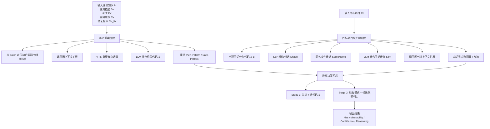

# VulnSight

> 一个基于 **补丁 + 漏洞描述 + 漏洞版本/修复版本代码 + 目标项目代码** 的语义级漏洞存在性验证工具。
>
> 它不是简单做版本号匹配，也不是只做字符串检索；而是先从漏洞版本与修复版本中**重建漏洞语义模式**，再在目标项目中构建候选空间，最后由大模型做**语义级漏洞再现判断**。

---

## 目录

- [1. 项目概述](#1-项目概述)
- [2. 核心能力](#2-核心能力)
- [3. 工作流总览](#3-工作流总览)
- [4. 项目结构](#4-项目结构)
- [5. 环境要求](#5-环境要求)
- [6. 安装与准备](#6-安装与准备)
- [7. 快速开始](#7-快速开始)
- [8. 命令行参数说明](#8-命令行参数说明)
- [9. 输入数据要求](#9-输入数据要求)
- [10. 输出结果说明](#10-输出结果说明)
- [11. 核心算法说明](#11-核心算法说明)
- [12. 模块说明](#12-模块说明)
- [13. Python API 用法](#13-python-api-用法)
- [14. 示例数据与测试样例](#14-示例数据与测试样例)
- [15. 缓存机制](#15-缓存机制)
- [16. 已知限制与注意事项](#16-已知限制与注意事项)
- [17. 常见问题](#17-常见问题)
- [18. 后续可改进方向](#18-后续可改进方向)

---

## 1. 项目概述

VulnSight 的目标是回答一个更“语义化”的问题：

**“这个待检测项目里，是否重新出现了某个已知漏洞的本质行为？”**

传统方案通常依赖以下几种手段：

1. **版本比对**：判断目标项目是否落在受影响版本范围内；
2. **补丁搜索**：查看目标代码中是否出现某段补丁前/后的特征代码；
3. **规则匹配**：通过固定规则或签名做匹配。

这类方案在面对以下情况时很容易失效：

- 目标项目并不是原始项目，而是**分叉版 / 二次开发版 / 搬运实现**；
- 漏洞逻辑被**重命名、重构、拆分**；
- 修复逻辑以**不同实现方式**存在，无法通过字符串级 diff 直接识别；
- 目标项目没有完全保留原始文件结构，但**语义行为仍然等价**。

VulnSight 的思路是：

- 用漏洞描述 `Dv`、补丁 `Pv`、漏洞版本代码 `Cv`、修复版本代码 `Cv_fix` 共同重建：
  - **Vuln-Pattern（漏洞语义模式）**
  - **Safe-Pattern（修复语义模式）**
- 再从目标项目 `Ct` 中，利用：
  - 代码块切分
  - 局部相似度检索（LSH / MinHash）
  - 同名文件兜底
  - LLM 辅助扩展
  - 调用图上下文扩展
- 最终把候选代码块交给 LLM 做两阶段决策：
  1. 先挑最值得展开的关键块；
  2. 再综合漏洞模式 / 修复模式 / 目标代码做最终判定。

因此，VulnSight 是一个 **“漏洞语义验证 pipeline”**，而不是一个单纯的字符串匹配脚本。

---

## 2. 核心能力

### 2.1 已实现能力

- 根据统一 diff 自动定位漏洞版本与修复版本中的补丁相关代码块；
- 结合漏洞描述与补丁差异，自动重建漏洞模式与修复模式；
- 对目标项目进行函数级 / 方法级 / 文件级代码块切分；
- 使用 MinHash + Jaccard 近似相似度构造初始候选集合；
- 利用 LLM 在目标工程中补充“可能遗漏但语义相关”的文件/函数；
- 支持缓存语义重建结果，避免重复消耗大模型调用；
- 输出结构化结论：
  - 是否存在漏洞
  - 置信度
  - 原因说明

### 2.2 代码层面支持的语言

从仓库代码来看，当前设计上支持：

- **Python**
- **Java**
- **C / C++**
- 以及其他语言/配置文件的**整文件级回退扫描**

---

## 3. 工作流总览



如果只看执行顺序，可以简单理解为：

1. **读入漏洞知识**；
2. **从漏洞版本与修复版本中学习“这个漏洞是什么”**；
3. **在目标项目里找最像的候选代码**；
4. **由 LLM 综合比较“漏洞模式 / 修复模式 / 目标代码”**；
5. **返回 yes/no + confidence + reasoning**。

---

## 4. 项目结构

基于当前压缩包，仓库主体结构如下：

```text
VulnSight/
├─ README.md                      # 项目说明文档
├─ LICENSE.txt                   # 开源许可证
├─ requirements.txt              # Python 依赖列表
├─ pyproject.toml                # 项目构建与打包配置
├─ .gitignore                    # Git 忽略规则
├─ 使用.txt                      # 早期中文使用说明（建议后续移除或并入 docs/）
│
├─ docs/
│  └─ usage_zh.md                # 中文使用文档
│
├─ examples/                     # 示例数据与复现实验样例
│  ├─ test/                      # 示例 1：cleo 漏洞检测样例
│  │  ├─ b5b9a04d2caf58bf7cf94eb7ae4a1ebbe60ea455.patch
│  │  ├─ 漏洞描述.txt
│  │  ├─ 测试结果1.txt
│  │  ├─ cleo-0.7.2/             # 待检测目标版本
│  │  ├─ cleo-1.0.0/             # 漏洞版本参考项目
│  │  └─ cleo-2.2.1/             # 修复版本参考项目
│  │
│  └─ test2/                     # 示例 2：fastapi / python-multipart 样例
│     ├─ 漏洞描述.txt
│     ├─ repair.patch
│     ├─ target1/                # 待检测目标项目 1
│     ├─ target2/                # 待检测目标项目 2
│     ├─ fix/                    # 修复版本参考项目
│     └─ vul/                    # 漏洞版本参考项目
│
├─ src/
│  ├─ run_VulnSight.py               # CLI 入口脚本
│  ├─ cache/                     # 运行过程中生成的缓存
│  │  └─ anon_596fd59a40bda322.json
│  │
│  └─ vulnsight/                     # VulnSight 核心源码包
│     ├─ __init__.py
│     ├─ vulnsight.py                # 顶层 VulnSight 类与主流程编排
│     ├─ types.py                # 核心数据结构定义
│     ├─ semantic_reconstruction.py
│     │                          # 漏洞/修复语义重建
│     ├─ preprocess_target.py    # 目标项目候选空间构建
│     ├─ prompt_decision.py      # 最终 LLM 判定阶段
│     ├─ utils.py                # 文件树、代码块摘要等工具函数
│     ├─ callgraph_builder.py    # 调用图构建统一接口
│     ├─ callgraph_pycg.py       # Python 调用图构建
│     ├─ callgraph_java.py       # Java 调用图构建
│     ├─ callgraph_clang.py      # C/C++ 调用图构建
│     │
│     └─ tool/
│        └─ Jarvis/              # 内置 Python 调用图分析工具
│           ├─ external_interface.py
│           ├─ jarvis.py
│           ├─ jarvis_cli.py
│           ├─ formats/          # 调用图输出格式
│           ├─ machinery/        # 调用图分析核心逻辑
│           ├─ processing/       # 处理流程与预处理模块
│           └─ utils/            # Jarvis 内部工具函数
│
└─ tests/                        # 测试目录
```

### 4.1 入口文件

项目主要入口是：

- `run_VulnSight.py`：命令行方式运行；
- `vulnsight.VulnSight`：Python API 方式调用。

---

## 5. 环境要求

### 5.1 Python 版本

建议：

- **Python 3.10+**

当前实验使用的是 `Python 3.10` 环境，因此 `Python 3.10` 是比较稳妥的选择。

### 5.2 核心依赖

当前仓库已经提供了本项目的依赖声明文件，包括：

- requirements.txt：用于快速安装运行期依赖
- pyproject.toml：用于描述项目元信息、构建方式与依赖配置

可通过以下方式安装依赖：

```bash
pip install -r requirements.txt
```

最低建议安装：

```bash
pip install openai unidiff
```

如果你希望启用更多语言能力，还建议安装：

```bash
pip install javalang
pip install clang
```

说明：

- `openai`：用于调用兼容 OpenAI SDK 的模型接口；
- `unidiff`：用于解析 `.patch` / unified diff；
- `javalang`：Java 方法级解析；
- `clang`：C/C++ 调用图能力依赖的 Python 绑定；
- Python 调用图能力依赖仓库内置的 `vulnsight/tool/Jarvis`，不需要额外安装 PyCG。

### 5.3 外部模型服务要求

当前 `run_VulnSight.py` 使用的是：

- OpenAI SDK 调用方式；
- `base_url="https://api.deepseek.com"`；
- `model="deepseek-chat"`。

也就是说，**本项目运行需要一个可用的 LLM 接口**。可以根据自己的需求进行修改，大模型的接口密钥应放于LLM_API_KEY环境变量中，见6.4。

---

## 6. 安装与准备

### 6.1 克隆 / 解压项目

```bash
unzip VulnSight.zip
cd VulnSight
```

### 6.2 创建虚拟环境（推荐）

**Windows PowerShell**

```powershell
python -m venv .venv
.\.venv\Scripts\Activate.ps1
```

**Linux / macOS**

```bash
python -m venv .venv
source .venv/bin/activate
```

### 6.3 安装依赖

```bash
pip install --upgrade pip
pip install openai unidiff javalang clang
```

如果你只想先跑当前示例，最低可先安装：

```bash
pip install openai unidiff
```

### 6.4 配置模型 API Key

**Bash**

```bash
export LLM_API_KEY="your_api_key"
```

**PowerShell**

```powershell
$env:LLM_API_KEY="your_api_key"
```

> 强烈建议只通过环境变量配置密钥，不要把真实密钥硬编码进源码。

---

## 7. 快速开始

### 7.1 直接运行示例

你提供的仓库中已经带有可直接运行的示例数据，最常见的启动方式如下：

```bash
python run_VulnSight.py \
  --vuln-id CLEO-EXAMPLE \
  --patch examples/test/b5b9a04d2caf58bf7cf94eb7ae4a1ebbe60ea455.patch \
  --desc examples/test/漏洞描述.txt \
  --vuln-root examples/test/cleo-1.0.0 \
  --fix-root examples/test/cleo-2.2.1 \
  --target-root examples/test/cleo-0.7.2
```

你给出的运行结果示例为：

```text
=== VulnSight Result ===
Vulnerability ID: CLEO-EXAMPLE
Target project: test/cleo-0.7.2
Has vulnerability: False
Confidence: 0.95
Reasoning:
  The target project appears to be version 0.7.2 of cleo (based on pyproject.toml), which predates the vulnerability patch. The provided candidate code blocks do not include the table.py file where the vulnerable regex would be located. However, the semantic patterns indicate the vulnerability is in the Table.set_rows method and the _render_cell function.
```

### 7.2 如果目标项目是 Python，建议的第一种使用姿势

如果你只是想快速验证流程，建议先：

- 不传 `--lang`；
- 优先确保 patch、漏洞描述、漏洞版本、修复版本、目标版本路径都正确；
- 先跑通主流程，再按需要开启语言增强能力。

这是因为当前仓库默认的“无 `--lang` 模式”会绕过一部分调用图扩展逻辑，兼容性反而更稳。

---

## 8. 命令行参数说明

`run_VulnSight.py` 支持以下参数：

### `--vuln-id`
漏洞标识符。

示例：

```bash
--vuln-id CVE-2024-24762
```

或示例数据中的：

```bash
--vuln-id CLEO-EXAMPLE
```

### `--patch`
补丁 diff 文件路径，要求是统一 diff（unified diff）格式。

示例：

```bash
--patch test/b5b9a04d2caf58bf7cf94eb7ae4a1ebbe60ea455.patch
```

### `--desc`
漏洞描述文本，既可以：

1. 直接传一段文本；
2. 也可以传 `.txt` / `.md` 文件路径。

如果传入的是一个存在的 `.txt` 或 `.md` 文件路径，程序会自动读取文件内容。

### `--vuln-root`
漏洞版本代码目录，即**确认存在漏洞的代码版本**。

### `--fix-root`
修复版本代码目录，即**已经打上补丁的代码版本**。

### `--target-root`
待检测目标项目目录。

它可以是：

- 原项目某个老版本；
- 某个 fork；
- 某个重构后的近似实现；
- 某个怀疑重新引入相同漏洞语义的代码树。

### `--lang`
语言提示，可选值示例：

```bash
--lang python
--lang java
--lang c
--lang cpp
```

作用：

- 告诉系统优先采用哪类调用图构建器；
- 影响语义重建与目标项目预处理中的语言相关逻辑。

> 当前仓库中，`--lang` 不是必填项；不传时，主要依赖代码块切分、LSH 与 LLM 扩展，通常更稳。

---

## 9. 输入数据要求

VulnSight 的输入不是单一文件，而是一组“漏洞知识 + 目标代码”的组合。

### 9.1 必需输入

#### 1）漏洞描述 `Dv`

可以来自：

- CVE/GHSA 描述；
- 安全公告；
- 自己整理的漏洞说明文本。

建议内容至少包含：

- 漏洞类型（如 RCE / SQLi / ReDoS / 路径穿越）；
- 触发条件；
- 漏洞入口 / 影响函数 / 影响模块；
- 修复方向（如果已知）。

#### 2）补丁 diff `Pv`

这是 VulnSight 的关键输入之一。

要求：

- 使用 unified diff 格式；
- diff 中的文件路径应当能和 `--vuln-root`、`--fix-root` 中的实际文件对应上；
- 最好来自真实修复提交。

VulnSight 会根据 patch 中的 hunk：

- 在漏洞版本代码中定位 `Bv(0)`；
- 在修复版本代码中定位 `Bvfix(0)`；
- 作为后续语义重建的起点。

#### 3）漏洞版本代码 `Cv`

这是“确认存在漏洞的参考版本”。

#### 4）修复版本代码 `Cv_fix`

这是“确认已修复”的参考版本。

#### 5）目标项目代码 `Ct`

这是最终要判断是否存在漏洞的代码目录。

### 9.2 输入之间的关系非常重要

为了让结果更可靠，需要保证：

- `patch` 的 old side 对应 `vuln-root`；
- `patch` 的 new side 对应 `fix-root`；
- `desc` 描述的是同一个漏洞；
- `target-root` 是你真正想验证的目标代码树。

如果这四者不对应，即使程序能跑完，语义判断也会明显失真。

---

## 10. 输出结果说明

程序最终会打印如下结构：

```text
=== VulnSight Result ===
Vulnerability ID: ...
Target project: ...
Has vulnerability: ...
Confidence: ...
Reasoning:
 ...
```

字段含义如下。

### `Vulnerability ID`
输入的漏洞标识。

### `Target project`
输入的目标项目路径。

### `Has vulnerability`
布尔值：

- `True`：模型判断目标项目中**存在**该漏洞语义；
- `False`：模型判断目标项目中**不存在**该漏洞语义。

### `Confidence`
置信度，范围通常在 `0 ~ 1`。

这不是严格统计学意义上的概率，而是 LLM 最终决策阶段输出的置信值，经代码解析后截断到 `[0,1]`。

### `Reasoning`
最终解释文本。

这部分一般会说明：

- 模型认为漏洞语义在哪里；
- 目标项目里是否找到对应危险行为；
- 是否存在等价修复；
- 为什么判断为有 / 无漏洞。

---

## 11. 核心算法说明

这一部分是本项目的关键。

### 11.1 阶段一：语义重建（`semantic_reconstruction.py`）

目标：从漏洞版本和修复版本中，学习出“漏洞长什么样”“修复长什么样”。

#### 步骤 1：定位 patch 相关初始代码块

通过 `locate_patch_blocks()`：

- 解析 `patch_diff`；
- 对每个 hunk：
  - 在 `vuln-root` 中截取旧代码块 `Bv0`；
  - 在 `fix-root` 中截取新代码块 `Bvfix0`。

这一步得到的是**最贴近补丁的原始代码片段**。

#### 步骤 2：调用图上下文扩展

如果指定了可用的语言提示，会尝试：

- 构建漏洞版本调用图 `Gv`；
- 构建修复版本调用图 `Gvfix`；
- 找到与补丁块相邻的一跳上下文代码块。

这样做的原因是：

> 一个漏洞往往不只在某个 patch hunk 内部成立，而是依赖其上下游函数、输入来源、辅助校验函数或错误处理路径。

#### 步骤 3：HITS 重要节点补充

在调用图上运行 `hits_scores()`，选取得分最高的节点块，用于补充“图结构上最重要的函数”。

#### 步骤 4：LLM 辅助扩展

`llm_expand_blocks()` 会把：

- 漏洞描述 `Dv`
- 补丁 `Pv`
- 已提取代码块摘要
- 项目文件树

交给 LLM，询问：

> 还有哪些文件/代码区段虽然不在 patch hunk 里，但从语义上和漏洞高度相关？

#### 步骤 5：抽取漏洞语义模式与修复语义模式

`llm_extract_patterns()` 会基于漏洞代码块 `Bv` 与修复代码块 `Bvfix` 输出两类模式：

- **Vuln-Pattern**
  - root cause（根因）
  - control-flow condition（控制流条件）
  - data-flow condition（数据流条件）
  - positive tests（可触发测试）

- **Safe-Pattern**
  - fix description（修复策略）
  - control-flow fix（控制流约束）
  - data-flow fix（数据流约束）
  - negative tests（修复后测试）

这一步相当于把“具体 patch”抽象成了“可迁移的语义模式”。

---

### 11.2 阶段二：目标项目候选空间构建（`preprocess_target.py`）

目标：在目标项目里找到**最值得判断**的候选代码块，而不是把整个项目全量塞给 LLM。

#### 步骤 1：全项目代码块切分

`build_blocks_for_project()` 会根据文件类型进行不同粒度切分：

- **Python**：优先 AST 提取函数 / 类级代码块，失败则启发式切分；
- **Java**：优先 `javalang` 方法级提取，失败则启发式切分；
- **其他语言 / 配置文件**：整文件一个块。

#### 步骤 2：LSH 相似候选

`select_shash()` 使用：

- token 切分；
- MinHash signature；
- 近似 Jaccard 相似度；

把目标块和参考漏洞/修复块做比对，筛出相似候选集合 `Shash`。

#### 步骤 3：同名文件兜底

如果目标项目中存在与参考块同名的文件，也会加入候选。

这是一个非常实用的工程性兜底策略，因为：

- 许多漏洞在 fork 项目中会保留原始文件名；
- 即便代码内容有改动，文件名仍然很有信号。

#### 步骤 4：LLM 补充目标候选

`llm_expand_target()` 会参考：

- 漏洞描述
- 补丁
- 参考块摘要
- 目标项目文件树
- 已选中的候选块

让 LLM 额外建议：

- 可能相关的文件；
- 可能相关的函数 / 方法；
- 大致行号范围。

#### 步骤 5：调用图一跳扩展

若调用图可用，则对当前候选块继续做一跳邻居扩展。

#### 步骤 6：裁切为完整函数 / 方法

`expand_block_range()` 会尽可能把块裁切为完整函数/方法，而不是只保留局部片段，降低 LLM 误判。

最终得到：

- `Bt`：目标项目全量代码块；
- `Scand`：最终候选代码块；
- `global_signals`：预计算的全局信号。

---

### 11.3 阶段三：最终决策（`prompt_decision.py`）

最终判定采用**两阶段 LLM 决策**。

#### Stage 1：重要块筛选

先把候选块摘要列表交给 LLM，让它选出：

- 最值得展开全文的代码块；
- 最可能影响最终结论的关键函数/类。

这是为了在 token 预算有限的情况下，把上下文优先留给真正有价值的代码。

#### Stage 2：最终漏洞判断

第二阶段会把以下信息综合送入 LLM：

- 漏洞描述 `Dv`
- patch diff `Pv`
- 参考漏洞/修复代码块 `Bv_ref`
- 漏洞模式 / 修复模式
- 目标候选代码块 `Scand`
- 全局信号（例如是否出现某些关键修复符号）

然后要求 LLM 输出：

```text
YES or NO
CONFIDENCE: 0.x
Reasoning...
```

代码再把这个结果解析为：

- `has_vuln`
- `confidence`
- `raw_reasoning`

---

## 12. 模块说明

### `run_VulnSight.py`

CLI 入口。

职责：

- 解析命令行参数；
- 读取 patch 和漏洞描述；
- 构造 `VulnKnowledge`；
- 初始化 `VulnSight`；
- 输出最终结果。

### `vulnsight/vulnsight.py`

项目总控模块。

职责：

- 组织“语义重建 -> 目标预处理 -> 最终判定”的主流程；
- 管理语义重建缓存；
- 对外暴露 `VulnSight.verify()`。

### `vulnsight/types.py`

核心数据结构定义，包括：

- `CodeSpan`
- `VulnPattern`
- `SafePattern`
- `VulnKnowledge`
- `CodeBlock`
- `CallGraph`
- `PatternPair`
- `PredictionResult`

### `vulnsight/semantic_reconstruction.py`

负责从漏洞版本与修复版本中抽取语义知识。

### `vulnsight/preprocess_target.py`

负责目标项目候选空间构建，是工程逻辑最重的一部分。

### `vulnsight/prompt_decision.py`

负责最终大模型提示词组织与结果解析。

### `vulnsight/callgraph_*`

按语言分别提供调用图构建器：

- Python：`callgraph_pycg.py`
- Java：`callgraph_java.py`
- C/C++：`callgraph_clang.py`

### `vulnsight/tool/Jarvis/`

仓库内置的 Python 调用图分析工具目录。

---

## 13. Python API 用法

除了 CLI，你也可以直接在 Python 代码里调用。

### 13.1 最小示例

```python
from openai import OpenAI
from vulnsight import VulnSight, VulnKnowledge

client = OpenAI(
    api_key="your_api_key",
    base_url="https://api.deepseek.com",
)


def my_llm(prompt: str) -> str:
    resp = client.chat.completions.create(
        model="deepseek-chat",
        messages=[
            {"role": "system", "content": "You are a helpful vulnerability analysis assistant."},
            {"role": "user", "content": prompt},
        ],
        temperature=0.2,
    )
    return resp.choices[0].message.content


vuln = VulnKnowledge(
    vuln_id="CLEO-EXAMPLE",
    desc=open("test/漏洞描述.txt", "r", encoding="utf-8").read(),
    patch_diff=open("test/b5b9a04d2caf58bf7cf94eb7ae4a1ebbe60ea455.patch", "r", encoding="utf-8").read(),
    vuln_proj_root="test/cleo-1.0.0",
    fix_proj_root="test/cleo-2.2.1",
)

vulnsight = VulnSight(
    llm=my_llm,
    language_hint="",
)

result = vulnsight.verify(
    target_root="test/cleo-0.7.2",
    vuln=vuln,
)

print(result.has_vuln)
print(result.confidence)
print(result.raw_reasoning)
```

### 13.2 可调参数

`VulnSight(...)` 目前支持：

- `llm`：LLM 调用函数，输入 prompt，输出纯文本；
- `language_hint`：语言提示；
- `hits_top_k`：语义重建阶段 HITS 选取数量；
- `jaccard_threshold`：LSH 相似度阈值；
- `num_perm`：MinHash permutation 数；
- `cache_enabled`：是否启用缓存。

例如：

```python
vulnsight = VulnSight(
    llm=my_llm,
    language_hint="python",
    hits_top_k=20,
    jaccard_threshold=0.6,
    num_perm=64,
    cache_enabled=True,
)
```

---

## 14. 示例数据与测试样例

压缩包中至少包含两组测试样例。

### 14.1 cleo 示例（`test/`）

相关文件：

- `examples/test/b5b9a04d2caf58bf7cf94eb7ae4a1ebbe60ea455.patch`
- `examples/test/漏洞描述.txt`
- `examples/test/cleo-1.0.0/`（漏洞版本）
- `examples/test/cleo-2.2.1/`（修复版本）
- `examples/test/cleo-0.7.2/`（目标版本）

该样例用于判断 `cleo-0.7.2` 是否重新出现了参考漏洞。

### 14.2 fastapi / python-multipart 示例（`test2/`）

相关目录/文件：

- `examples/test2/vul/`
- `examples/test2/patch/`
- `examples/test2/target1/`
- `examples/test2/target2/`
- `examples/test2/漏洞描述.txt`
- `examples/test2/20f0ef6b4e4caf7d69a667c54dff57fe467109a4`
- `examples/test2/fastapi9d34ad0ee8a0dfbbcce06f76c2d5d851085024fc`

可以据此扩展出类似命令：

```bash
python run_VulnSight.py \
  --vuln-id fastapi-EXAMPLE \
  --patch examples/test2/20f0ef6b4e4caf7d69a667c54dff57fe467109a4 \
  --desc examples/test2/漏洞描述.txt \
  --vuln-root examples/test2/vul \
  --fix-root examples/test2/patch \
  --target-root examples/test2/target1
```

以及：

```bash
python run_VulnSight.py \
  --vuln-id fastapi-EXAMPLE \
  --patch examples/test2/20f0ef6b4e4caf7d69a667c54dff57fe467109a4 \
  --desc examples/test2/漏洞描述.txt \
  --vuln-root examples/test2/vul \
  --fix-root examples/test2/patch \
  --target-root examples/test2/target2
```

---

## 15. 缓存机制

VulnSight 在 `vulnsight/vulnsight.py` 中实现了**语义重建缓存**。

### 15.1 缓存内容

缓存主要保存：

- `vuln_pattern`
- `safe_pattern`
- `vuln_blocks`
- `fix_blocks`

也就是说，缓存的是“漏洞语义重建阶段”的中间结果，而不是最终对目标项目的判定结果。

### 15.2 缓存位置

缓存目录为：

```text
src/cache/
```

注意这里的 `./` 是**当前运行工作目录**，不是强绑定项目源码目录。

### 15.3 缓存收益

当你多次复用同一组：

- 漏洞描述
- patch
- 漏洞版本
- 修复版本

去检测不同目标项目时，缓存能显著减少重复 LLM 调用。

这对于批量验证多个 target 非常有用。

---

## 16. 已知限制与注意事项

这一节非常重要。以下内容是根据当前仓库代码静态分析总结出的真实注意事项。

### 16.1 LLM 输出格式依赖较强

项目中大量中间步骤都依赖大模型按指定格式输出：

- JSON
- tagged text
- YES/NO + CONFIDENCE

虽然代码里做了一些兜底解析，但如果模型不遵守格式，仍可能导致：

- 候选扩展失败；
- 模式提取不完整；
- 结果退化到默认行为。

因此建议：

- 选择指令遵循性较好的模型；
- 保持低温度（例如 `0.2`）；
- 尽量不要改动现有输出格式约束。

### 16.2 该项目更适合做“语义辅助判断”，不宜直接当作绝对真值判定器

VulnSight 输出的是：

- 语义上的存在性推断；
- 由候选代码块与 LLM reasoning 支撑的判断。

它很适合作为：

- 漏洞复现筛查器；
- fork 项目排查工具；
- 安全分析辅助器。

但不建议把它直接当作：

- 法律/合规意义上的最终结论；
- 无需人工复核的安全审计报告生成器。

---

## 17. 常见问题

### Q1：`--desc` 必须是文件吗？

不是。

你可以直接传文本，也可以传 `.txt` / `.md` 文件路径。

### Q2：patch 一定要来自 GitHub commit 吗？

不一定，但必须是**标准 unified diff**，并且 old/new 文件路径能映射到 `vuln-root` / `fix-root`。

### Q3：如果目标项目目录很大，会不会很慢？

会。因为它需要：

- 枚举项目文件；
- 构建代码块；
- 做 LSH；
- 调用 LLM 多次。

大项目上建议：

- 先精简目标目录；
- 或先在子模块级运行；
- 或提升缓存复用率。

### Q4：如果目标项目没有和漏洞文件完全相同的文件名，还能识别吗？

可以，理论上 VulnSight 的设计就是为了处理这类场景。

它会利用：

- 语义模式；
- LSH 相似块；
- LLM 推断的额外相关文件/函数；
- 调用图上下文。

### Q5：能不能直接支持本地模型？

可以，只要你把 `llm(prompt: str) -> str` 这个接口接到你自己的模型上即可。

CLI 默认示例只是用 DeepSeek 兼容接口，不是唯一选择。

---

## 18. 后续可改进方向

如果你准备继续迭代这个项目，建议优先做以下增强：

### 18.1 更新依赖与打包配置

根据你的需求更新：

- `requirements.txt`
- `pyproject.toml`

### 18.2 增加批量检测模式

当前入口主要面向“单漏洞 + 单目标项目”的一次运行。

可以扩展为：

- 一个漏洞知识库；
- 多个目标项目批量扫描；
- 输出 JSON / CSV / HTML 报告。

### 18.3 强化结果可解释性

可以把以下信息输出到报告中：

- 命中的候选块列表；
- 最关键的漏洞模式映射；
- 候选与参考代码块相似度；
- 最终 prompt 的精简版证据链。

---

## 总结

VulnSight 的核心价值不在于“扫版本号”，而在于：

> **把一个已知漏洞从“补丁级知识”提升到“语义级知识”，再去验证目标项目是否重新出现了相同风险行为。**

如果你的应用场景是：

- 分析开源项目 fork 是否复现某个漏洞；
- 判断老版本 / 改写版本 / 迁移版本是否仍保留危险行为；
- 用大模型辅助做漏洞存在性验证；


## License

This project is licensed under the MIT License. See `LICENSE.txt` for details.